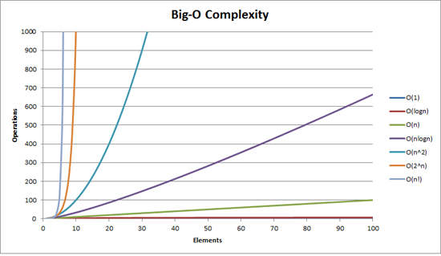

# Time Complexity 
## Algorithm
- 알고리즘 

    하나 이상의 연산(operation)을 필요로 하는 과정들의 유한집합
    
- 알고리즘 분석시 고려할 사항

    - 논리적, 수학적으로 증명 가능한가?
    - 자료의 저장 메모리를 고려했는가?
    - 병령 수행의 빈도수를 고려했는가?

> **적은 공간**과, **적은 수행**을 실시함으로 **효율적인 프로그램** 을 구현하기 위한 수단 

- 알고리즘의 복잡도 평가

    - O-표기법을 통해 판단 : **최악**의 상황을 고려한 방식
        - **O(1)** : 상수시간 소요 (ex.Stack)
        - **O(log n)** : 로그시간 소요 (ex.Binary Tree)
        - **O(n)** : 1차시간 소요 (선형) (ex.for loop)
        - O(n log n) : N logn 시간 소요 (ex.Quick Sort, Merge Sort, Heap Sort)
        - **O(n2)** : 2차시간 소요 (quadratic) (ex.Double for loop, Insert Sort, Bubble Sort, Selection Sort)
        - **O(2n)** : 지수시간 소요 (ex.Fibonacci Sequence)
        - O(n!) : N 팩토리얼 시간 소요(factorial)
        - O(nm) : N의 M제곱 시간 소요

- 시간복잡도(O-표기법) : 오른쪽으로 갈 수록 복잡

> **O(1)** < **O(log n)** < **O(n)** < O(n log n) < **O(n2)** < **O(2n)** < O(n!) < O(nm) 

*이미지 출처 : https://gompangs.tistory.com/entry/%EC%95%8C%EA%B3%A0%EB%A6%AC%EC%A6%98-%EC%8B%9C%EA%B0%84%EB%B3%B5%EC%9E%A1%EB%8F%84Time-Complexity*