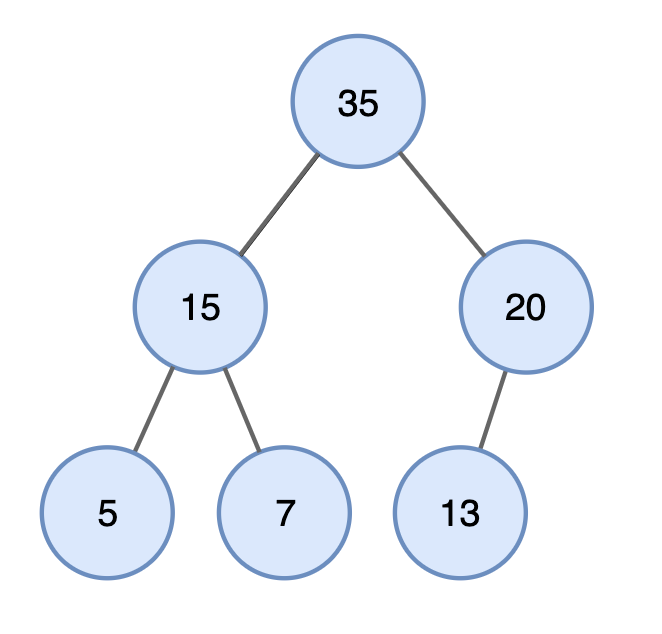

# Priority Queue
## 우선순위 큐 : 우선순위가 가장 높은 데이터를 가장 먼저 삭제하는 자료구조
- 우선순위 큐는 데이터를 우선순위에 따라 처리하고 싶을 때 사용.
    - 스택 : 가장 **나중에** 삽입된 데이터가 추출
    - 큐 : 가장 **먼저** 삽입된 데이터가 추출
    - 우선순위큐 : 가장 **우선순위가 높은** 데이터
        - 스택과 큐는 공평한 *데이터구조*라고 비유적으로 표현

- 우선순위 큐를 구현하는 방법
    - 단순히 리스트를 이용해 구현
        - 삽입시간 : `O(1)`
        - 삭제시간 : `O(N)`
    - 힙(Heap)을 이용해 구현 
        - 삽입시간 : `O(logN)`
        - 삭제시간 : `O(logN)`
        > 힙정렬 : 단순히 N개의 데이터를 힙에 넣었다가 모두 꺼내기만 해도 그 자체로 정렬을 수행   
            힙정렬에 따른 시간복잡도 : `O(NlogN)`

## Heap
- 힙 : 완전 이진 트리 자료구조의 일종
    > 완전 이진 트리(Complete Binary Tree) :  
        루트(root)노드부터 시작하여 왼쪽 자식노드, 오른쪽 자식노드 순서대로  
        데이터가 차례대로 삽입되는 트리(tree)
- 힙에 새로운 원소가 삽입될 때 : 삽입 되자마자 조건에 맞게 정렬  
    ~~태어나면 위계질서 잡아야지~~
- 힙에 원소가 삭제될 때 : 항상 **루트노드를 제거**  
    - 가장 마지막 노드가 사라지면 빈 노드가 되버리므로  
        가장 어린 노드가 루트로 와서 다시 정렬  
        ~~할머니가 죽고 유산정리해서 막내한테 돌려주기!~~  
        ~~부모님은 있을 때 잘하자~~
- 최소 힙(min heap) : 루트노드가 가장 **작음** ex. 오름차순
    - (상향식) 부모노드로 거슬러 올라가며, 부모보다 자신의 값이 더 작은 경우 위치를 교체  
        ~~자식한테 더 주고 싶은 부모마음~~
- 최대 힙(max heap) : 루트노드가 가장 **큼** ex. 내림차순
    - (하향식) 부모노드로 거슬러 올라가며, 부모보다 자신의 값이 더 작은 경우 위치를 교체  
        ~~상당히 가부장적인 자료구조네...~~



*이미지 출처 : https://yoongrammer.tistory.com/80*

- 힙을 이용한 우선순위 큐 예시
```python
import sys
import heapq
input = sys.stdin.readline

def heapsort(iterable):
    h = []
    result = []
    # 모든 원소를 차례대로 힙에 삽입
    for value in iterable:
        heapq.heappush(h, value) # 내림차순시 value -> -value
    # 힙에 삽입된 모든 원소를 차례대로 꺼내어 담기
    for i in range(len(h)):
        result.append(heapq.heappop(h)) # 내림차순시 heapq -> -heapq
    return result

n = int(input())
arr = []

for i in range(n):
    arr.append(int(input()))

res = heapsort(arr)

for i in range(n):
    print(res[i])
```

- python, C++, Java 등 각 언어마다 상향식, 하향식의 **기준이 다름을 주의**
- python : 오름차순기준 상향식 (min heap)
- C++ : 내림차순 하향식(max heap)