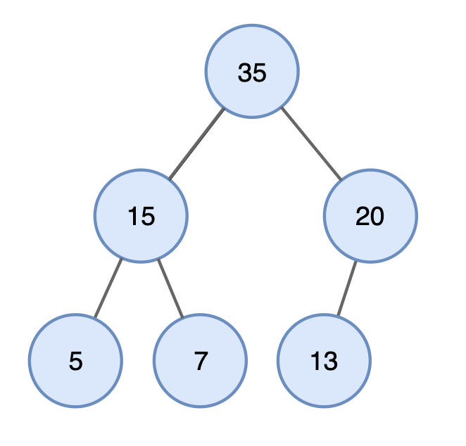

# Tree
## 트리 : 계층적인 구조를 표현할 때 사용할 수 있는 자료구조 (ex. 가계도)



*이미지 출처 : https://yoongrammer.tistory.com/80*

- 루트노드(root node) : 부모가 없는 최상위 노드 (ex. *35*)
- 단말노드(leaf nood) : 자식이 없는 노드 (ex. *5, 7, 13*)
- 크기(size) : 트리에 포함된 모든 노드의 개수 (ex. *6*)
- 깊이(depth) : 루트 노드로부터의 거리 (ex. *최대 깊이 : 2*)
- 높이(height) : 깊이 중 최댓값(ex. *2*)
- 차수(degree) : 각 노드의 (자식방향) 간선 개수  
(ex. *35의 차수는 2*, *20의 차수는 1*)

> 기본적으로 트리의 크기가 N 일때, 전체 간선의 갯수는 N-1개 입니다.

### 이진탐색트리(Binary Search Tree)


*이미지 출처 : https://yoongrammer.tistory.com/71*

- 이진탐색이 동작할 수 있도록 고안된 효율적인 탐색이 가능한 자료구조의 일종
- 이진탐색의 특징 : 왼쪽 자식노드 < 부모 노드 < 오른쪽 자식 노드
    - 부모노드보다 왼쪽 자식노드가 작습니다.(ex. *30>*1)
    - 부모노드보다 오른쪽 자식 노드가 큽니다.(ex. *70>80*)

- 이진탐색트리에서 데이터를 찾는 방법
    - 60을 찾는 방법

        1. 루트노드 방문해 탐색 (현재 루트노드 : *50*)
        2. 찾는 원소(*60*)은 현재 루트노드(*50*)보다 크므로 **오른쪽** 방문
        
            (루트노드 *50*을 기준으로 왼쪽은 탐색 X → 시간효율↑)
        3. 찾는 원소(*60*)은 현재 루트노드(*70*)보다 작으므로 **왼쪽** 방문 
        
            (루트노드 *70*을 기준으로 오른쪽은 탐색 X)

        4. 최종 찾는 원소(*60*) 도착 : 탐색 종료

> 탐색 범위가 '이진탐색트리'와 같이 이상적인 경우 시간복잡도 : log N

### 트리의 순회
- 트리 자료구조에 포함된 노드를 특정한 방법으로 한번씩 방문하는 방법
    - 트리의 정보를 시각적으로 확인 가능
- 대표적인 트리 순회 방법 3가지
    - 전위순회(**Pre**order Traverse) : 루트를 먼저 방문

        (ex. *50 > 30 > 1 > 35 > 70 > 60 > 80*)
    - 중위순회(**In**order Traverse) : 왼쪽 자식 먼저 방문 > 루트 방문
    
        (ex. *1 > 30 > 35 > 50 > 60 > 70 > 80*)
    - 후위순회(**Post**order Traverse) : 왼쪽 자식 방문 > 오른쪽 자식 방문 > 루트 방문
    
        (ex. *1 > 35 > 30 > 60 > 80 > 70 > 50*)

```python
class Node:
    def __init__(self, data, left_node, right_node):
        self.data = data
        self.left_node = left_node
        self.right_node = right_node

# 전위순회(Preorder Traversal)
def pre_order(node):
    print(node.data, end=' ')
    if node.left_node != None:
        pre_prder(tree[node.left_node])
    if node.right_node != None:
        pre_prder(tree[node.right_node])
        
# 중위순회(Inorder Traversal)
def in_order(node):
    if node.left_node != None:
        pre_prder(tree[node.left_node])
   print(node.data, end=' ')
    if node.right_node != None:
        pre_prder(tree[node.right_node])

# 후위순회(Postorder Traversal)
def post_order(node):
    if node.left_node != None:
        pre_prder(tree[node.left_node])
    if node.right_node != None:
        pre_prder(tree[node.right_node])
    print(node.data, end=' ')

n = int(input())
tree = {}

for i in range(n):
    data, left_node, right_node = input().split()
    if left_node == 'None':
        left_node = None
    if right_node == 'None':
        right_node = None
    tree[data] = node(data, left_node, right_node)

pre_order(tree['A'])
print()    
in_order(tree['A'])
print()
post_order(tree['A'])
print()
```
```python
# 실제 적용시 data 형태
7 # input data 갯수 : A B C D E F G
A B C       # A의 자식노드 : 왼쪽 자식 B, 오른쪽 자식 C
B D E       # B의 자식노드 : 왼쪽 자식 D, 오른쪽 자식 E
C F G       # C의 자식노드 : 왼쪽 자식 F, 오른쪽 자식 G
D None None # D의 자식노드 : 없음(단말 노드: leaf node)
E None None # E의 자식노드 : 없음
F None None # F의 자식노드 : 없음
G None None # G의 자식노드 : 없음
A B D E C F G # 전위노드 (pre_order)
D B E A F C G # 중위노드 (in_order)
D E B F G C A # 후위노드 (post_order)
```
